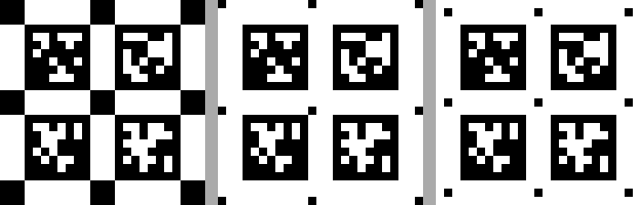

# AprilTag 标定板（AprilTag 3 / pyapriltags 专用）

> **旧标定板不能用了。** AprilTag 3 只能解码**黑边 1 格**的 tag，而 cvte `apriltag2`
> 出的图默认是黑边 2 格 —— 实测那种板子一个 tag 都检不出来。这一版是 `black_border=1` 的新板。
> 本目录下的所有文件都由 `core/make_board/apriltag_helper.py` 现算，图里的每个 tag 都是从
> 内置码表渲染出来的（652 个图案与参考仓库的 PNG 逐像素比对零误差），**不依赖任何外部图片**。

## 打印

| 项目 | 值 |
|---|---|
| 打印用 | `tag36h11_6x6_tag32mm_bb1_print.pdf`（推荐，页面尺寸是固定的物理尺寸） |
| 备用 | `tag36h11_6x6_tag32mm_bb1_print.png` |
| 预览 | `tag36h11_6x6_tag32mm_bb1_preview.png` |
| 纸张尺寸 | **276.0 mm × 276.0 mm** |
| 建议纸张 | A3（297×420 mm）能放下；A4 放不下 |
| 分辨率 | 约 298 DPI，每格 47 px |

打印时**务必关掉"适应页面 / fit to page"**，按 100% 或按上面给出的毫米数打印。

## black_border 是什么

一个 AprilTag 的图案外面要留一圈**纯黑边框**，检测算法靠它把 tag 从背景里"切"出来。
`black_border` 就是这圈黑边的宽度，单位是**一个白色数据格**：

```
        ← black_border →
    ┌───┬───────────────┬───┐   ↑
    │   │  ██ ░░ ██ ░░  │   │   │ black_border
    ├───┼───────────────┼───┤   ↓
    │   │  ░░ ██ ░░ ██  │   │      ← tag36h11 的数据区 6x6
    │   │  ██ ░░ ░░ ██  │   │
    ├───┼───────────────┼───┤   ↑
    │   │  ░░ ██ ██ ░░  │   │   │ black_border
    └───┴───────────────┴───┘   ↓
```

- `black_border=1`（**本版**）→ 整张 tag 是 8×8 格，即 6×6 数据 + 1 圈黑边。
  这也是 AprilTag 3 家族定义里写死的宽度，改不了。
- `black_border=2`（**旧版**）→ 整张 tag 是 10×10 格，黑边更宽一圈。
  AprilTag 2（cvte 那套封装）支持任意宽度，AprilTag 3 不支持，所以旧板必须作废。

肉眼区别：把 tag 的外边框到第一格黑白图案之间的距离数一数，旧板是 2 个小格子宽，新板是 1 个小格子宽。

## 网格上的黑色小方块（标记块）

每个 tag 的四角外侧各有一个黑色小方块，它们落在标签之间白色间隔的**交叉点**上，
全板共 `(6+1) x (6+1)` = 49 个，尺寸 1 格。

**这些方块对 AprilTag 检测没有任何作用**，纯粹是把网格结构标给人看。实测 `marker_size=0/1/2`
三档的**检出个数与重投影 RMS 完全一致**，所以想去掉它、让图更干净，把 `make_board.py` 顶部的
`MARKER_SIZE` 改成 `0` 即可。

和原 apriltag2 出的图比，这里有两处是**故意改的**（都是实测出来的坑）：

| | 原 apriltag2 | 本版 | 为什么改 |
|---|---|---|---|
| 块的大小 | `tag_spacing` 格 | `<= tag_spacing-2` 格 | 原版的大块正好与 tag 黑边框**对角相连**，AprilTag 3 把这种连通的黑色区域当成一个整体四边形，相邻 tag 被一起吃掉。实测 6×6 板只能检出 **34/36**，4×4 板 **15/16** |
| 块的位置 | 跟着瓦片画在瓦片四角 | 画在网格交叉点，且**所有 tag 贴完后再统一落块** | 相邻瓦片是重叠摆放的（步距 `rect+spacing`，瓦片边长 `rect+2·spacing`），后贴的瓦片白边会把先贴的块**覆盖掉**。实测原做法 2×2 板 16 个块只剩 8 个，每个 tag 周围看着只有 1 个块 |

改完之后：全板 49 个交叉点**一个不缺**，每个 tag 四角**都有块**（板最外圈的 tag 也不缺），
且所有块彼此独立、与最近的 tag 至少隔 1 格白边。

三种画法的真实渲染对比（左：原 apriltag2；中：修复前；右：修复后）：



## 规格参数

| 项 | 值 |
|---|---|
| tag 家族 | `tag36h11`（数据区 6×6） |
| 黑边 `black_border` | **1 格** |
| tag 间距 `tag_spacing` | 3 格 |
| 排布 | 6 行 × 6 列，起始 id = 0 |
| 单格边长 | 4.000 mm |
| **tag 边长** `tag_size`（含黑边） | **32.000 mm** = 0.03200 m |
| **tag 净间距** `space_size` | **12.000 mm** = 0.01200 m |
| 相邻 tag 中心距 | 44.000 mm |
| 整张图纸 | 69 × 69 格 = 276.0 × 276.0 mm |

**填进 `calib_board_info` / `create_calib_board_3d` 的值**：

```
[0.03200, 0.01200, 6, 6]
```

## 打印后必须做的一步：量整宽、修正参数

打印机和出图软件几乎总有千分之几的整体缩放，而这个缩放会 **1:1 传给标定结果**
（焦距、手眼 X/Y/Z 全都被拉歪），而且看不出明显异常。

**不要去量单个 tag**（钢尺 ±0.5 mm，对 32 mm 就是 1.5% 误差）；
**去量整张图纸的宽**，同样的 ±0.5 mm 摊到 276 mm 上只剩 0.2%：

```python
from core.make_board import apriltag_helper as ah

tag_size, space_size = ah.rescale_calib_board_params(
    tag_size=0.03200,
    space_size=0.01200,
    paper_measured_mm=275.5,      # <- 你量出来的图纸实际宽度
    paper_nominal_mm=276.000,       # 理论宽度
)
# 用修正后的 tag_size / space_size 再跑标定
```

## 代码里的完整用法

```python
from core.make_board import apriltag_helper as ah

tag_size   = 0.03200                                              # 含黑边的 tag 边长(米)
space_size = ah.calib_board_space_size(tag_size, "tag36h11", black_border=1, tag_spacing=3)

tag3d_list = ah.create_calib_board_3d(tag_size, space_size, 6, 6, 0)
tag2d_list = ah.Detector("tag36h11", black_border=1).detect(img, -1)
T_cam_board = ah.locate_calib_board(tag2d_list, tag3d_list, K, D, th_reproj=1.0)
```

`space_size` **不要手算**（1 格 = `tag_size / (6 + 2×1)` = 4.000 mm），
一律用 `calib_board_space_size()`，算错会带来一个很难发现的尺度误差。

## 换规格

改 `make_board.py` 顶部的「可改参数」再跑一次即可，README 会自动重写。
常见组合（图纸 = (3×(cols+1) + 8×cols) 格）：

| 单格 | tag 边长 | 间距 | 6×6 图纸 | 适用纸张 |
|---|---|---|---|---|
| 3.0 mm | 24.0 mm | 9.0 mm | 207.0 mm | A4 |
| **4.0 mm** | **32.0 mm** | **12.0 mm** | **276.0 mm** | **A3（本版）** |
| 5.0 mm | 40.0 mm | 15.0 mm | 345.0 mm | A2 / 打印店 |

## 出图时的自检结果

- 图纸共 36 个 tag，全部检出：**36/36**
- 整板重投影 RMS：**0.0815 px**
